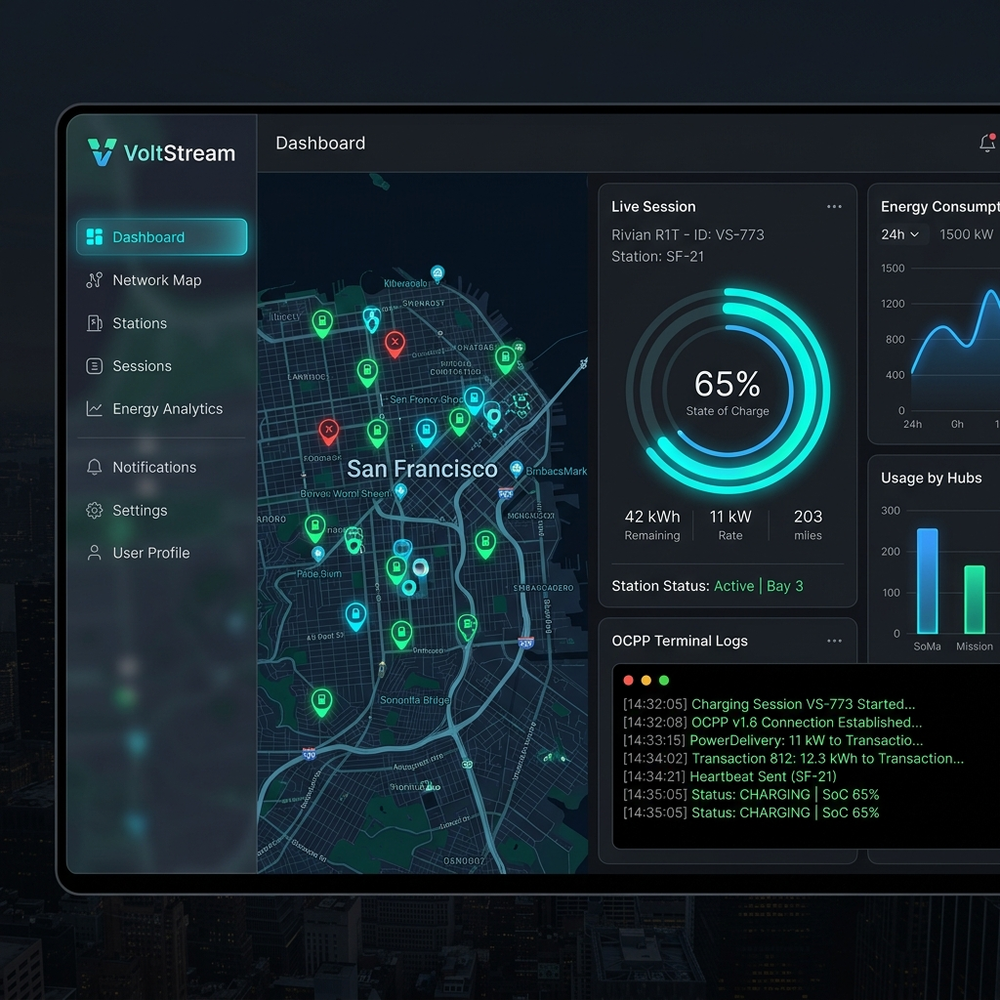

# VoltStream: Connected, Interoperable & Reliable EV Charging Ecosystem

VoltStream is a high-fidelity interactive dashboard prototype built for the **ET AutoTech Hackathon 2026** under **Theme 4: Seamless EV Charging Ecosystem**. 

It demonstrates a connected, interoperable charging platform that solves network fragmentation, grid overload, and payment frictions in the EV space, presenting distinct user perspectives for both **EV Drivers** (Driver Companion) and **Grid Operators** (Grid Operations Console).

---

## 📸 Dashboard Mockup Preview



---

## 🎯 Theme 4 Problem Statement & Solution

**Problem Statement:** Design solutions to enable a connected, interoperable, and reliable EV charging ecosystem that delivers a seamless and user-friendly experience across networks and platforms.

**VoltStream Solution:** VoltStream aggregates fragmented charge point operators (CPO networks) into a unified console. It integrates **ISO 15118 Plug & Charge** to eliminate multi-app payment overheads, applies real-time **OCPP 2.0.1 diagnostics** with local fault recovery queues to ensure high communications reliability, utilizes **HTML5 Geolocation** to map multi-gun ports on a dynamic grid, and simulates **AI State of Health (SoH) diagnostics** to create circular battery passports.

---

## 🗺️ Focus Areas Coverage Matrix

| Focus Area | Prototype Feature | How It Works |
| :--- | :--- | :--- |
| **1. Charger Interoperability** | **Multi-CPO Aggregator Map** | Integrates independent operators (**Tata Power, Zeon, ChargeZone, Bolt**) into a unified geospatial plane. Shows real-time dynamic connector feeds at the individual **Gun-level** (e.g. Gun A CCS2, Gun B Type 2). |
| **2. Reliable Communication** | **OCPP 2.0.1 Socket Logger** | Exposes standard JSON WebSocket packets exchanged between the Charge Point (CP) and Central System (CS). Simulates local **Flash Memory buffering** during network dropouts to prevent data loss. |
| **3. Unified Interfaces & Payments** | **ISO 15118 Plug & Charge** | Initiates secure cryptographic vehicle authorization and automated billing once connected. Uses a single centralized **pre-funded wallet balance** to settle bills across all network operators. |
| **4. Real-time Availability & Routing** | **Live Geolocation & Routing** | Uses the browser's native **HTML5 Geolocation API** to track vehicle location and synthesizes realistic local petrol-pump EV hubs around the driver's coordinates with flowing route plotting. |

---

## ⚡ Alignment with Hackathon Core Objectives

In **Grid Operations** mode, the system exposes dynamic mapping cards outlining how its operations impact the overall Automotive ecosystem:

1. **Customer & In-car Experience**: Enriches the cockpit view by combining real-time charger telemetry with battery data to calculate adaptive vehicle ranges (accounting for Indian road/traffic factors) and charging rate curves, eliminating range anxiety.
2. **EV Ecosystem Scalability**: Scales charging operations by eliminating manual mobile application sign-ups, using standardized ISO 15118 Plug & Charge cryptographic handshakes.
3. **Workforce Productivity & Grid Resilience**: Maximizes operator uptime via remote diagnostics, remote reboot controls, and simulates smart grid load-throttling to dynamically limit power output (e.g. from 150kW to 70kW) during substation overload peaks.
4. **Supply Chain Resilience & Manufacturing Efficiency**: Generates digital battery passports by measuring State of Health (SoH) degradation profiles to qualify cells for secondary grid-storage reuse, reducing dependencies on raw mineral mining.

---

## 🛠️ Step-by-Step Simulation Run Guide

To test the prototype's interactive elements, toggle the **Perspective Switcher** in the sidebar to **Grid Operations** and turn on **"Show Focus Areas"**:

1. **Test ISO 15118 Plug & Charge**: On the dashboard, click the plug connector illustration. Watch the physical plug connection lock, the secure TLS handshake perform certificate verification, and the OCPP energy transaction start automatically.
2. **Test Smart Grid Peak Load Throttling**: Initiate an active charging session, then click **"Simulate Grid Peak"** in the top bar. The grid load rises to 92%, triggering an OCPP `SetChargingProfile` event that limits charger speeds to 70kW, displaying a flashing **"GRID THROTTLED"** alert badge on the driver’s console.
3. **Test Local Outage Recovery Queue**: Click **"Simulate Connection Cut"** to simulate a cellular outage. The system switches to *NOC Offline*. Initiate a charging session; the station logs local updates in its local memory buffer. Click **"Restore Connection"** to watch the station flush and sync the cached telemetry packets.
4. **Test Dynamic Geolocation Mapping**: Navigate to the map tab and click the **"Locate Me"** (crosshair) button. Approve location permissions. The map centers on your actual location, plots your vehicle with a pulsing marker, and dynamically synthesizes local petrol-pump charging hubs around your coordinates.

---

## 🚀 Local Deployment Instructions

### Prerequisites
* **Node.js** (v18.x or higher)
* **Angular CLI** (v18.x)

### Installation & Startup
1. Extract the submission ZIP file.
2. Open a terminal in the root directory.
3. Install dependencies:
   ```bash
   npm install
   ```
4. Start the local development server:
   ```bash
   npm start
   ```
5. Open your web browser and navigate to:
   `http://localhost:4200`
