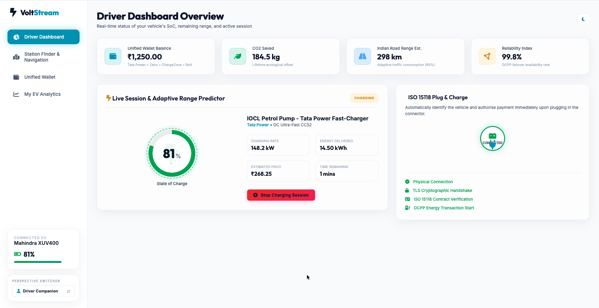

# ⚡ VoltStream — Seamless EV Charging Ecosystem

> **ET AutoTech Hackathon 2026 | Theme 4: Seamless EV Charging Ecosystem**  
> **Original Solution** — Built from scratch using Angular 18

---

## 🔗 Quick Links

| Resource | Link |
|:---|:---|
| 🌐 **Interactive Prototype (Live)** | [seamless-ev-charging-ecosyste.onrender.com](https://seamless-ev-charging-ecosyste.onrender.com) |
| 📊 **Presentation (Slides)** | [mahesh-morde.github.io/Seamless-EV-Charging-Ecosyste](https://mahesh-morde.github.io/Seamless-EV-Charging-Ecosyste/) |
| 🎬 **Demo Video (Screen Recording)** | [Watch on YouTube](https://youtu.be/h-na91u-GgA) |
| 💻 **Source Code** | [github.com/mahesh-morde/Seamless-EV-Charging-Ecosyste](https://github.com/mahesh-morde/Seamless-EV-Charging-Ecosyste) |

---

## 📸 Live Dashboard Screenshot



*Driver Dashboard showing: 81% SoC live gauge, active charging session at IOCL Petrol Pump (148.2 kW, Tata Power CCS2), ISO 15118 Plug & Charge handshake completed, unified wallet balance ₹1,250, and 184.5 kg CO₂ saved.*

---

## 🎯 Problem Statement

> *"Design solutions to enable a connected, interoperable, and reliable EV charging ecosystem that delivers a seamless and user-friendly experience across networks and platforms."*

**VoltStream** solves this by unifying fragmented CPO networks (Tata Power, Zeon, ChargeZone, Bolt) into one intelligent platform — with ISO 15118 auto-authentication, OCPP 2.0.1 reliability, and AI battery lifecycle analytics.

---

## 🗺️ Focus Areas Coverage

| Focus Area | Feature | Coverage |
|:---|:---|:---:|
| **1. Charger Interoperability** | Multi-CPO map with Gun-level port status feeds across 4 networks | ✅ Excellent |
| **2. Reliable Communication** | Live OCPP 2.0.1 logs, offline Flash memory queue, Smart Grid throttling | ✅ Outstanding |
| **3. Unified Access & Payments** | ISO 15118 Plug & Charge + single cross-network wallet settlement | ✅ Excellent |
| **4. Navigation & Routing** | HTML5 Geolocation, petrol-pump EV hub synthesis, glowing route plotting | ✅ Strong |

---

## ✨ Key Features

- **Dual Perspectives** — EV Driver Companion + Grid Operations Console (NOC)
- **ISO 15118 Plug & Charge** — Cryptographic vehicle ID + auto-payment on plug-in
- **OCPP 2.0.1 Protocol Monitor** — Live WebSocket JSON logs with remote reboot
- **Smart Grid Throttling** — SetChargingProfile limits chargers from 150kW→70kW during peak load
- **Offline Buffer Recovery** — Flash memory queue syncs telemetry when network restores
- **Live GPS Station Finder** — Petrol pump EV hubs (IOCL, HPCL, BPCL, Jio-bp) generated around real location
- **Glowing Route Plotting** — Animated electric polyline from car to selected charger
- **Battery SoH Passport** — AI State of Health tracker for second-life grid storage
- **Light / Dark Theme** — Full glassmorphic UI with micro-animations
- **Numbered Map Markers** — Sidebar list matches map pin numbers for instant orientation

---

## 🛠️ Tech Stack

| Layer | Technology |
|:---|:---|
| Frontend Framework | Angular 18 (Standalone Components) |
| Mapping | Leaflet.js + HTML5 Geolocation API |
| Protocols | OCPP 2.0.1, ISO 15118 (simulated) |
| Charts | Chart.js |
| Styling | SCSS + Glassmorphism + CSS Animations |
| Typography | Outfit + Inter (Google Fonts) |
| Icons | FontAwesome 6 |
| Deployment | Render.com + Docker + GitHub Pages |

---

## 🚀 Run Locally

```bash
# 1. Clone the repo
git clone https://github.com/mahesh-morde/Seamless-EV-Charging-Ecosyste.git
cd Seamless-EV-Charging-Ecosyste

# 2. Install dependencies
npm install

# 3. Start development server
npm run dev

# 4. Open in browser
# http://localhost:4200
```

## 🐳 Run with Docker

```bash
docker build -t voltstream-ev .
docker run -p 8080:80 voltstream-ev
# http://localhost:8080
```

---

## 🎮 Interactive Demo Guide

1. **Switch to Grid Operations** — Click "Perspective Switcher" in the sidebar → Grid Operations
2. **Show Focus Areas** — Click "Show Mapped Focus Areas" to see hackathon alignment overlays
3. **ISO 15118 Plug & Charge** — Dashboard → click the plug → watch TLS handshake → OCPP transaction
4. **Grid Peak Simulation** — Click "Simulate Grid Peak" → charger throttles from 150kW → 70kW
5. **Network Outage Recovery** — "Simulate Connection Cut" → offline queue → "Restore" → auto-sync
6. **Live GPS Routing** — Map tab → click crosshair → approve location → select a station → glowing route

---

*Built with ❤️ for India's EV Future — ET AutoTech Hackathon 2026*
